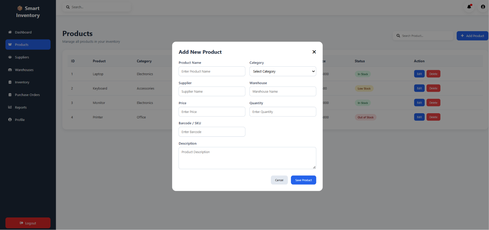
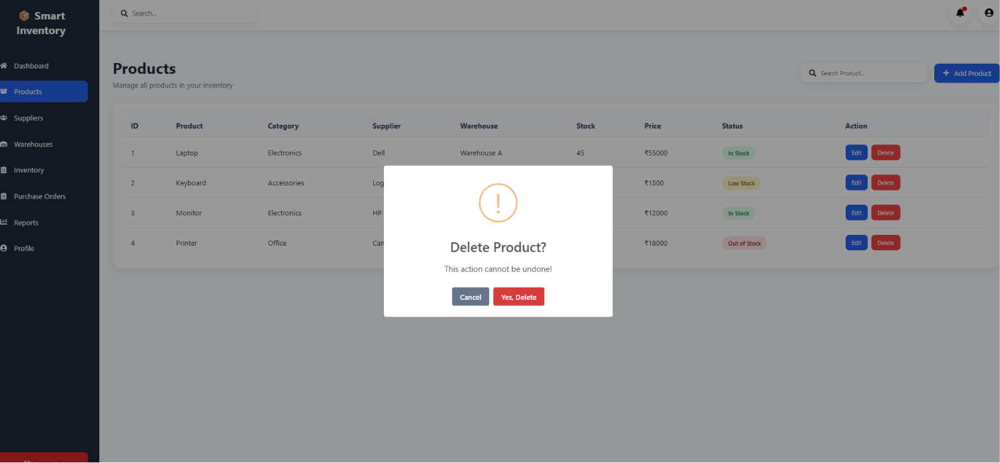
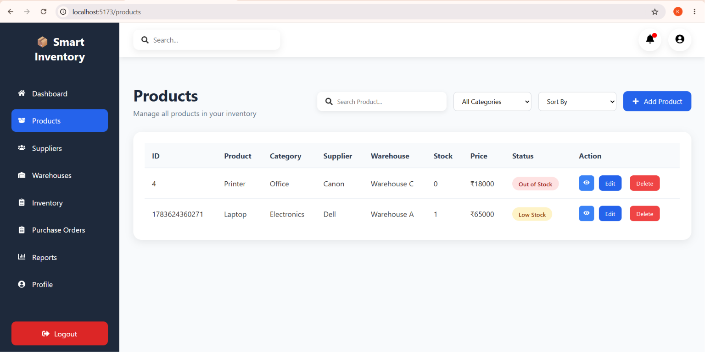

# 📦 Smart Inventory Tracker

> A modern and responsive Inventory Management System developed during my **Web Development Internship at Abreonix** using **React.js**.


---

# 📖 About the Project

Smart Inventory Tracker is a modern Inventory Management System designed to simplify inventory operations for businesses. It provides an interactive dashboard to monitor inventory, manage products, track stock levels, and visualize inventory insights.

This project is currently being developed as part of my **Web Development Internship at Abreonix**. Future updates will include backend integration, authentication, supplier management, warehouse management, reports, and deployment.

---

# ✨ Current Features

## 🔐 Authentication

- Modern Login Interface
- Responsive Login Design

---

## 📊 Dashboard

- Dashboard Overview
- Statistics Cards
- Total Products
- Total Suppliers
- Total Warehouses
- Low Stock Overview
- Inventory Overview Line Chart
- Stock Distribution Pie Chart
- Recent Purchase Orders
- Recent Activities
- Top Selling Products
- Low Stock Alerts
- Inventory Health Progress
- Welcome Banner
- Quick Action Buttons
- Export Dashboard as PDF

---

## 📦 Product Management

- View Products
- Add New Product
- Edit Product
- Delete Product
- View Product Details
- Search Products
- Category Filter
- Product Sorting
- Dynamic Stock Status
- Local Storage Support
- Toast Notifications
- SweetAlert Confirmation Dialogs

---

## 🎨 UI Features

- Responsive Design
- Modern Dashboard Layout
- Sidebar Navigation
- Clean User Interface

---

# 🚧 Current Project Status

## ✅ Completed Modules

- Login
- Dashboard
- Product Management
- Search Functionality
- Category Filter
- Product Sorting
- Product Details Modal
- Local Storage Integration
- Responsive User Interface

---

## 🚀 Upcoming Modules

- Suppliers Management
- Warehouses Management
- Purchase Orders
- Reports & Analytics
- User Profile
- Settings
- Notifications
- Dark Mode

---

# 🌐 Backend (Upcoming)

The following technologies will be integrated in future versions:

- Node.js
- Express.js
- PostgreSQL
- REST APIs
- JWT Authentication
- CRUD Operations
- File Upload
- Dashboard APIs

---

# 🛠️ Tech Stack

## Frontend

- React.js
- Vite
- JSX
- CSS3

---

## Libraries Used

- React Router DOM
- React Icons
- Chart.js
- React ChartJS 2
- jsPDF
- html2canvas
- SweetAlert2
- React Toastify

---

# 📂 Project Structure

```text
Smart Inventory Tracker
│
├── public
│
├── src
│   ├── assets
│   ├── components
│   │   ├── dashboard
│   │   ├── layout
│   │   └── products
│   │
│   ├── pages
│   │   ├── Dashboard.jsx
│   │   ├── Products.jsx
│   │   └── Login.jsx
│   │
│   ├── styles
│   ├── App.jsx
│   └── main.jsx
│
├── package.json
├── vite.config.js
└── README.md
```

---

# 🚀 Installation

Clone the repository

```bash
git clone https://github.com/zunaira0411/Abreonix_Project.git
```

Move into the project folder

```bash
cd Abreonix_Project
```

Install dependencies

```bash
npm install
```

Run the development server

```bash
npm run dev
```

---

# 📸 Screenshots

## 🔐 Login Page


---

## 📊 Dashboard


---

## 📦 Products Page




---

## 👁️ Product Details



---

# 📊 Project Progress

| Module | Status |
|---------|--------|
| Login | ✅ Completed |
| Dashboard | ✅ Completed |
| Products | ✅ Completed |
| Suppliers | ⏳ In Progress |
| Warehouses | ⏳ Pending |
| Purchase Orders | ⏳ Pending |
| Reports | ⏳ Pending |
| Backend | ⏳ Pending |
| Deployment | ⏳ Pending |

---

# 🎯 Future Scope

- Backend Integration
- PostgreSQL Database
- JWT Authentication
- Supplier Management
- Warehouse Management
- Purchase Orders
- Reports & Analytics
- Export to Excel
- Image Upload
- User Authentication
- Dark Theme
- Cloud Deployment

---

# 👨‍💻 Developer

**Zunaira Fatima**

🎓 BCA IBM

🏫 United University

Developed as a part of the **Abreonix Web Development Internship**.

---

# ⭐ Support

If you like this project, please consider giving it a ⭐ on GitHub.

---

# 📜 License

This project is developed for educational and internship purposes.
